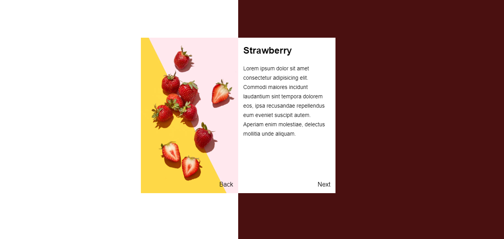

# Flip Book Animation

This project is an interactive flip book animation created using HTML and CSS. The flip book simulates the turning of pages with a smooth 3D flipping effect, offering a visually appealing and engaging user experience.

Check out the live version of the website [here](https://shubiks.github.io/Flip-Book-Design-Website/).

## Technologies Used

- **HTML5**: For structuring the content and layout of the flip book.
- **CSS3**: For styling, animations, and 3D flip effects.


## Project Structure

```
Flip-Book/
│
├── index.html         # Main HTML file for the flip book structure
├── CSS/
│   └── style.css      # Contains all the styling and animations for the flip book
├── assets/
│   ├── cover-page.jfif  # Cover image for the flip book
│   ├── Strawberry.jfif  # Image on page 1
│   └── pineapple.jfif   # Image on page 2
└── README.md          # Project documentation
```

## Screenshots

### Output

